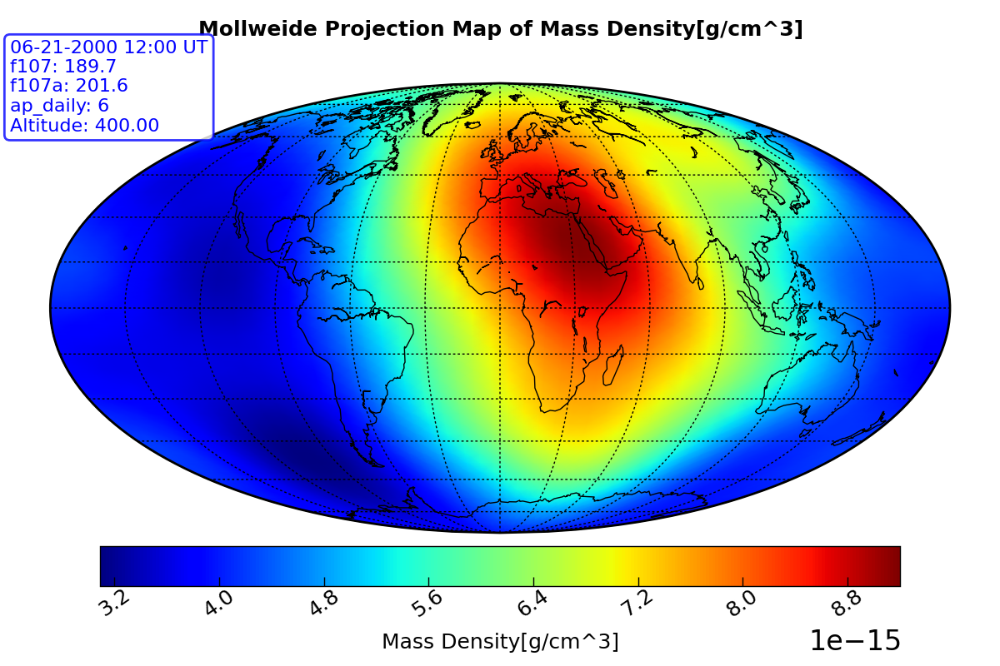
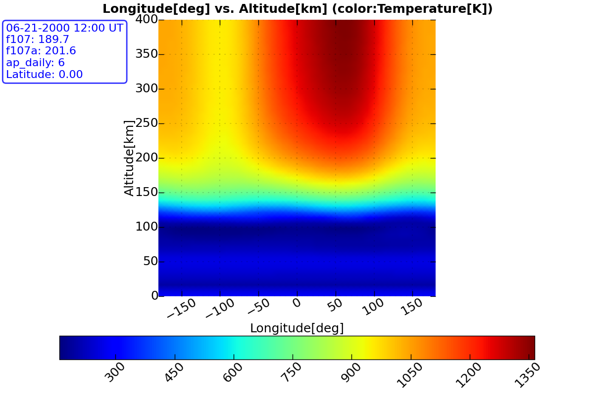
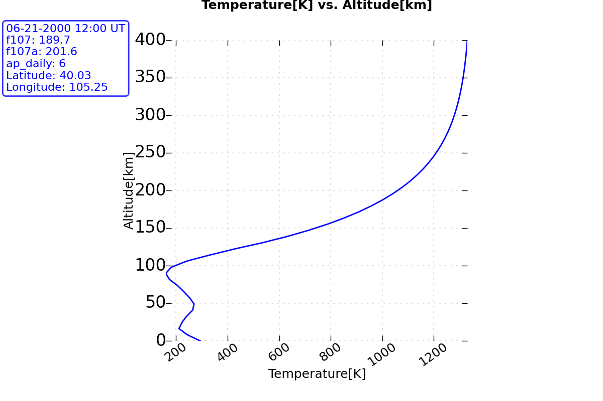
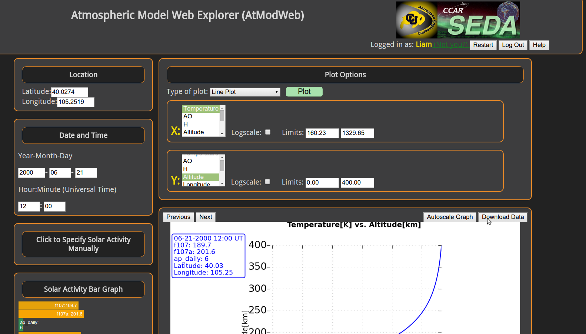

Getting Started Using AtModWeb
==============================

We designed AtModWeb to be intuitive and easy to use, but this guide will help you get started if you're stuck.

The main think to remember is the interface is designed to be explored. If you don't understand what something does, mouse over it, or click it and see. You can always click the 'Restart' button if things go wrong.

.. _how-to-make-graphs:

How To Make A Plot
==================

Map
---

This is a 2 dimensional plot, which means that the program will run the model for a grid of latitude and longitude points at a FIXED ALTITUDE. This will show you how the quantity you are investigating varies over the entire atmosphere. It will draw your data over outlines of all of the continents in, by default a `Mollweide <https://en.wikipedia.org/wiki/Mollweide_projection>`_ projection, which is a type of map which tries to visualize the 3D earth in a way that accurately represent relative size (remember how huge Greenland looks in some maps? It's not actually that big, that's the projection's fault). 

You only have two choices when you are making a map:
	
1. What model output variable you want to look at (Temperature,Density,Amount of Oxygen, etc.)
2. The Altitude, in kilometers, that you want to run the model at.

Example:
Say you want to investigate where on earth you would expect a spacecraft in low earth orbit to encounter the most wind resistance (A.K.A `satellite drag <http://www.swpc.noaa.gov/impacts/satellite-drag>`_), then you would choose your altitude to be 400 km, and your 'Color' variable to be 'dens', for the density of the atmosphere. Wherever the density was higher than average, the spacecraft would experience greater drag. 

   Example of AtModWeb output graph for the satellite drag example, the temperature at a constant altitude of 400 km.

Cross-Section
-------------  

A cross-section plot (sometimes called a heatmap or pseudocolor plot) is another type of 2 dimensional plot, which lets you visualize how the model result you are looking at (Temperature, Atmospheric Density, etc.) organizes in a slice of the atmosphere. This means that the program creates a grid of points a all altitudes along a line of latitude or longitude and then plots the output of the model along this slice. This lets you see trends that depend both on how high you are in the atmosphere, and where you are on the earth.

   An example of a cross-section plot. Note that the upper atmosphere is much hotter than the lower atmosphere, and that the equator is hotter than either of the poles. This example is for the peak of summer (solstice).

Line
----
A line plot is simply an X vs. Y plot. One of the variables, either X or Y, must be one of the locations (Altitude,Latitude,or Longitude), because it doesn't make sense to draw the line that relates temperature to density. Since you vary one of the location variables, the other two must, by definition, be fixed.
For example, if you wanted to see how the atmospheric temperature changes for a balloon launched on a windless day over the University of Colorado, in Boulder you would enter 40.0274 and 105.2519 in the latitude and longitude controls, and change the Y selector to be 'Altitude', and the X variable selector to be 'Temperature', and then click 'Plot'. 

.. NOTE:
	Multiple Dependant Variables
	By holding the Shift key and selecting multiple model result variables, you can plot multiple variables versus the same location variable.

   An example of a line plot, showing the altitude profile of atmospheric temperature above Boulder, Colorao.

.. _how-to-download-data:

How To Download Model Results
=============================

The 'Download' button just above your plot will download all of the data that went into your plot as a comma seperated value (`CSV <https://en.wikipedia.org/wiki/Comma-separated_values>`_) file. The number of columns and thier identity depends on what you were plotting. For example, a map plot or cross-section will have 3 columns, latitude, longitude and whatever model output variable you're visualizing. Line plots may have 2 or more columns depending on how many variables you have chosen to plot.

   Click the *Download* button to download a CSV file. In this case it would have 2 columns, Altitude and Temperature.